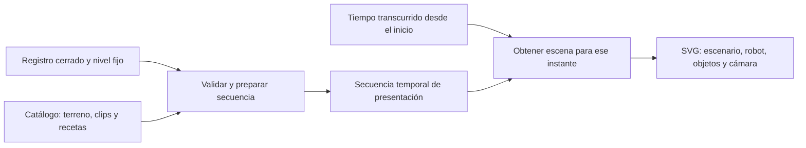

# Animación y catálogo visual

**Reproductor del nivel principal periódico.** Define cómo presentar el [registro de ejecución](registro-de-ejecucion.md). La animación avanza automáticamente, a velocidad fija, hacia adelante y sin controles del usuario. Conserva el flujo y las garantías acordadas en [experiencia](../intent/experiencia.md) e [intentos](../intent/intentos.md). El perfil visual vigente cubre las siete secciones del nivel, incluidas las fases de barrera y plataforma.

## Enfoque elegido

**React con una escena SVG que compone sprites, un catálogo visual y un único reloj de reproducción.** Los sprites pueden ser imágenes raster dentro del SVG; SVG no obliga a dibujar todo el arte con vectores. No se renderiza un video en el servidor ni se ejecuta física en el navegador. [Capacidad de SVG para incluir imágenes](https://developer.mozilla.org/en-US/docs/Web/SVG/Reference/Element/image).

La API entrega estados y resoluciones, no instrucciones como «dibujar frame 6» o «esperar 200 ms». El navegador prepara una secuencia temporal finita y la dibuja de principio a fin, en el orden registrado. Las duraciones de los clips pertenecen al perfil visual y permanecen fijas durante la reproducción; no hay un multiplicador de velocidad configurable por el usuario.

## Escenario: tramos, apoyos y capas

Los tipos pozo, llano, rama o barrera pertenecen a **tramos entre apoyos seguros**. La posición lógica del robot pertenece a un apoyo. Esta diferencia debe verse: un pozo no elimina los puntos donde puede aterrizar y el cambio de fase vecino no deja al robot suspendido sobre un hueco.

Se utiliza una unidad horizontal por tramo, apoyos en coordenadas enteras y una línea de suelo compartida. El perfil visual define el ancho visible de los apoyos, los bordes del pozo y las alturas de paso. Son medidas de dibujo, no hitboxes del motor. El escalado a pantalla no altera las unidades del mundo.

El escenario se compone, de atrás hacia adelante, de fondo, terreno trasero, suelo/apoyos, objetos/salida, robot y oclusiones delanteras. Así el borde de un pozo puede ocultar parte del robot que cae y una rama puede tener piezas delante y detrás. Una rama se construye con suelo más obstáculo superior; no hace falta una imagen distinta del suelo para cada acción del robot.

El catálogo distingue tipo de tramo y estado efectivo. Una plataforma periódica en estado `pit` conserva su identidad visual de plataforma; el valor guardado determina su fase presente. Durante las acciones no oscila por su cuenta. Una transición entre fases es presentación entre turnos, nunca un nuevo estado que el agente pueda aprovechar.

Si todo el nivel entra de forma legible, se dibuja completo. Si no, la cámara desplaza el mundo horizontalmente y respeta sus extremos. Su posición depende del mismo instante de reproducción, sin suavizados que acumulen historia entre frames. La cámara mantiene su altura durante una caída.

## Catálogo de sprites y clips

| Elemento | Datos del catálogo | Ejemplos |
|---|---|---|
| Recurso gráfico | Identidad, URL inmutable, tamaño, recorte si pertenece a un atlas, punto de anclaje | Frame del robot, suelo, rama, llave. |
| Clip | Frames y duración de cada uno; repetición dentro del intervalo o pose final | Caminar, salto, agachado, quieto, recoger, caer, impacto, victoria. |
| Terreno | Tipo/estado, piezas por capa, dimensiones y anclas semánticas | Borde de entrada del pozo, contacto con obstáculo superior. |
| Objeto y salida | Identidad visual por tipo, estado y ancla en el apoyo | Llave presente/recogida; salida bloqueada/habilitada. |
| Receta | Trayectoria, clips, marcadores y efectos para una acción con su resultado | Desplazar caminando; aproximar al borde y caer; recoger y habilitar salida. |
| Perfil visual | Nivel y reglas del contrato vigente; geometría, catálogo y recetas coherentes | Interpretación completa de los registros admitidos. |

El perfil vigente usa un SVG original con símbolos para robot, terreno, salida y efectos, publicado con URL de asset versionada por el build. Las poses del robot comparten cabeza, torso, extremidades, cara y paleta; transforman esas mismas piezas para caminar, saltar, agacharse, caer, chocar y celebrar. Esta construcción conserva proporciones y ancla de pies entre poses sin generar imágenes independientes para cada frame. El catálogo representa las siete secciones del nivel, los estados bajo/alto de la barrera y la plataforma en suelo/pozo; no contiene objetos en el contrato vigente.

El anclaje del robot está en los pies. Cambiar de frame o de postura conserva ese punto de referencia; así un sprite más alto no desplaza al personaje. La orientación base se refleja para caminar, saltar o agacharse a la izquierda; no se duplica un set completo por dirección. Si algún arte asimétrico necesita variantes, el catálogo puede seleccionarlas sin cambiar los datos del intento.

Esperar, recoger y otros gestos sin dirección conservan la orientación del último movimiento; la inicial puede ser derecha. Esa orientación se deriva al preparar la secuencia, sin necesitar otro campo del motor ni depender de cuántos frames se hayan dibujado.

El frame se elige mediante el tiempo local del clip y las duraciones acumuladas. No se usa el número de repintados como contador. Se puede empezar con archivos individuales; agruparlos luego en un atlas solo cambia recursos y recortes. Los clips comparten el reloj de la escena para mantener sincronizados gesto, desplazamiento e interacción.

## Componer acción, recorrido y reacción

La acción indica el gesto intentado. La resolución indica qué pasó. El perfil combina ambos; no se construye una animación independiente para cada combinación de terreno × acción × resultado.

| Registro | Composición visual |
|---|---|
| Caminar con `moved` | Clip caminar + desplazamiento entre apoyos. |
| Saltar con `moved` | Preparación + arco visual + aterrizaje en el apoyo posterior. |
| Agacharse con `moved` | Bajar postura + cruzar agachado + recuperar postura al terminar. No queda agachado entre acciones. |
| Caminar/agacharse con `fall` | Aproximarse al borde cercano del pozo + perder apoyo + caer. No atravesar el vacío caminando. |
| Movimiento con `collision` | Iniciar el gesto + detenerlo en el contacto visual correspondiente + reacción de choque. |
| Recoger con `picked_up` | Gesto local + retirar el objeto identificado + representar inventario/salida posteriores. |
| Esperar o no-op | Clip local sin desplazamiento. La causa diferencia espera, límite del mapa, falta de objeto o habilidad sin efecto. |
| Estado posterior de victoria | Completar la acción que ganó y luego celebrar; también funciona al recoger una llave sin moverse. |
| Límite, cancelación o error | Conservar la pose del último evento; presentar la causa de cierre, sin inventar derrota. |

La receta de caída usa el borde de entrada más cercano al origen según la dirección. La de choque usa el contacto del obstáculo superior o de la barrera y la modalidad de movimiento. Estas anclas pertenecen al dibujo; **no se calculan colisiones de sprites ni se simula gravedad para decidir el desenlace**. Los arcos y curvas son fórmulas de presentación con destino y resultado ya resueltos.

Después de una caída o choque, la escena final conserva la pose terminal de la receta. Dibujar únicamente el último snapshot recolocaría incorrectamente al robot en su último apoyo seguro. Por eso la escena a un instante depende tanto de los estados como del evento que los conecta, incluido el último frame y la vista del resultado.

## Orden dentro de un turno

Cada evento se convierte en intervalos y marcadores de presentación, calculados una vez a partir del perfil:

1. Mostrar el estado anterior y empezar el gesto.
2. Presentar desplazamiento o interacción y, si corresponde, caída o choque. El terreno conserva la fase del estado anterior durante toda la acción.
3. En el marcador de interacción, aplicar a la escena los objetos, inventario y salida registrados: por ejemplo, retirar la llave al recogerla. No esperar al cambio de fase ni recoger al pasar caminando.
4. Completar el gesto en su pose de llegada o terminal.
5. Si el juego continúa, presentar el cambio del terreno anterior al posterior. Los tramos que cambian lo hacen en la misma transición; luego empieza la siguiente acción. Si termina, no crear otra fase jugable.

Los marcadores son condiciones sobre el tiempo, no callbacks que mutan el mundo. Antes del marcador de recogida se muestra el objeto y después se oculta, incluso si el navegador omitió algún frame. Durante una transición se pueden mezclar dos imágenes, pero no existe una nueva decisión ni un estado físico intermedio.

Una duración ilustrativa de caminar puede ser distinta de saltar o caer. El tiempo que Bedrock tardó en decidir no se reproduce como una espera: permanece en la auditoría. Una acción explícita `Esperar` sí tiene su clip y consume el turno que el servidor registró. La celebración final agrega presentación, no un turno.

## Reproducción continua a velocidad fija

`prepareReplay(record, profile)` construye los intervalos, marcadores y recursos requeridos. `sample(t)` devuelve terreno, objetos, salida, posición/pose/frame del robot, efectos y cámara para el tiempo transcurrido `t`. Es una función interna de dibujo: la misma entrada y tiempo producen la misma escena, sin depender de haber reproducido todos los frames anteriores. No constituye una función de búsqueda o navegación disponible al usuario.

El reloj conserva el instante de inicio y calcula `tiempo = min(ahora - inicio, duraciónTotal)` con una fuente monotónica. Avanza hacia adelante hasta completar la secuencia, sin estados de pausa, cambios de velocidad, retrocesos, saltos de turno ni finalización anticipada por controles del usuario. Los intervalos propios de esperar, aterrizar o celebrar forman parte de la animación continua.

`requestAnimationFrame` solicita el repintado y aporta el timestamp, pero no define la duración mediante conteo de frames. El navegador puede suspender los repintados en pestañas ocultas; el reloj de presentación no se pausa por pérdida de foco. Al volver se dibuja el estado correspondiente al tiempo transcurrido o se completa la presentación si ya terminó. Esto puede omitir frames que no fueron visibles, pero no reordena los turnos, cambia el resultado ni requiere pulsar Reanudar. [Contrato del reloj del navegador](https://developer.mozilla.org/en-US/docs/Web/API/Window/requestAnimationFrame).

Se actualiza solo el componente de escena y la información visible del progreso, sin hacer que el editor y el historial se vuelvan a renderizar por cada frame. CSS sirve para estilos, pero no hay cadenas de `setTimeout`, transiciones CSS o animaciones independientes que gobiernen posición, frames, fases, objetos o efectos significativos. Todos se muestrean desde `t`.

La pantalla puede informar el turno que se está mostrando, sin controles de transporte, deslizador interactivo ni atajos de teclado que alteren la reproducción. No se anuncian cambios accesibles por cada frame. Después del resultado se puede iniciar otra visualización completa del registro; mientras esa visualización está en curso rige la misma reproducción continua y sin controles.

## Integración con Probar y el resultado

Se conserva **Probar → bloqueo → cálculo → animación si estaba habilitada → resultado**. El toggle queda fijado por intento. La animación solo empieza con registro cerrado, secuencia completa, nivel fijo y recursos preparados. Mientras se cargan muestra «Preparando animación», sin adelantar métricas o habilitar el editor. El perfil vigente carga el SVG versionado y comprueba los símbolos requeridos antes de comenzar. Si un perfil futuro usa imágenes raster, su precarga debe comprobar también la [decodificación](https://developer.mozilla.org/en-US/docs/Web/API/HTMLImageElement/decode).

Con Animación apagada, el resultado no espera descarga de sprites ni del detalle de reproducción. Se conserva el registro completo en el servidor para volver a verlo desde el resultado o el historial. Con Animación encendida, el fin automático de la secuencia —incluida reacción o celebración final— libera el resultado. Durante la animación no hay controles operativos, incluido Cancelar; el editor permanece bloqueado hasta que termine.

Para recuperar este flujo se guarda por intento el valor fijado de Animación y una marca de presentación terminada al acceder al resultado. Si una recarga encuentra presentación pendiente, reinicia automáticamente la animación desde el comienzo del registro cerrado; no promete continuar en el frame exacto ni escribe progreso por frame. Si la marca ya existe, puede abrir el resultado directamente. La marca es de UI: no modifica el cierre del juego, cuota o consumo. Un fallo al guardar esa marca puede causar una repetición visual al recargar, nunca repetir inferencia ni impedir consultar el resultado ya presentado.

La visualización iniciada desde el resultado o el historial parte del mismo registro y no borra esa marca. Avanza automáticamente de principio a fin, mantiene bloqueados editor e historial mientras se presenta y vuelve al resultado al terminar. Una cancelación/error con cero acciones muestra su resultado directamente; con acciones reproduce solo las publicadas si corresponde al toggle. Una llamada inválida o un reintento nunca se dibujan como Esperar.

Si falta un recurso o el registro no puede interpretarse, la pantalla informa **error de reproducción**, conserva el resultado real y permite acceder a él; no queda bloqueada indefinidamente ni cambia una victoria a error de ejecución. Se puede reintentar la carga del replay. Un gráfico desconocido no se sustituye silenciosamente por suelo, una fase distinta o una secuencia incompleta. No se añade un segundo catálogo de emergencia que haya que mantener.

## Compatibilidad y extensión

Una reproducción fija un perfil y catálogo completos al empezar. Sus assets tienen URLs inmutables para que no se mezclen versiones a mitad de una secuencia. El perfil declara qué formatos, tipos de terreno/objeto, acciones y causas interpreta. La publicación verifica que todo contenido soportado tenga representación, incluidas sus fases y resultados.

La garantía es la misma secuencia lógica para registros del contrato vigente, no los mismos píxeles. Se pueden mejorar skins y clips conservando el significado, sin fijar arte dentro del motor. La aplicación acepta un único perfil de registro vigente; un esquema, referencia o causa retirada se rechaza explícitamente. No se mantienen lectores, perfiles visuales ni adaptaciones para registros de contratos reemplazados, y nunca se reconstruye el pasado con reglas nuevas. Los datos de prueba anteriores pueden permanecer si no estorban o eliminarse.

Agregar una variante visual de llano o rama requiere recursos y un descriptor del catálogo. Agregar una mecánica nueva requiere su definición en el nivel, reglas del motor, observación, resultados registrados y representación visual. Si produce resultados ya existentes —desplazamiento, caída, choque— reutiliza las recetas; un efecto nuevo amplía el contrato y su receta. No se necesita un sistema de plugins, generación de código ni un editor de niveles para lograr esa extensión.

## Alternativas y fundamento

La alternativa más fuerte es **PixiJS**, con el mismo registro, secuencia temporal y reloj. Aporta renderers gráficos especializados y manejo de texturas; también añade su integración y ciclo de vida. Su ticker tampoco elimina la necesidad de sincronizar la escena con la secuencia registrada. [Renderers](https://pixijs.com/8.x/guides/components/renderers) y [ticker de PixiJS](https://pixijs.com/8.x/guides/components/ticker).

Para el recorrido de un robot y obstáculos descrito, se elige SVG con imágenes por su menor carga inicial y composición directa desde React. Ese fundamento no constituye un benchmark ni una afirmación de que PixiJS sea incapaz. Canvas 2D propio obliga a mantener dibujo/recortes/escalado; Phaser añade un modelo de juego que este reproductor sin física no necesita. Se reconsideraría PixiJS si el arte o una medición real justifican el cambio; el contrato guardado no depende del renderer.

## Comprobaciones del diseño al implementar

- La secuencia avanza automáticamente a velocidad fija y en orden hasta el resultado, sin controles ni atajos de pausa, búsqueda, retroceso o salto. Perder foco no activa una pausa ni exige reanudar.
- Escena, cámara, objetos y fases corresponden al tiempo transcurrido aunque el navegador omita un repintado; todos los elementos comparten el reloj.
- Saltar y agacharse cruzan un tramo en ambas direcciones; caída/choque detienen el cruce y mantienen su pose terminal sin volver al apoyo.
- Esperar conserva la posición y cambia la fase después de la acción; una fase nueva no hace caer al robot parado en un apoyo.
- Recoger retira exactamente el objeto registrado; pasar no lo recoge; salida bloqueada no celebra; recoger la llave en la salida puede celebrar sin caminar.
- Derrota, victoria y límite en el último turno reproducen la precedencia ya resuelta; cancelación/error no agregan una acción.
- Ambos valores de Animación guardan el mismo registro; no hay inferencia durante replay, métricas anticipadas ni edición durante presentación.
- Recarga, assets fallidos, registro incompleto y formato no soportado conservan el resultado y evitan una UI permanentemente bloqueada.
- Un registro del contrato vigente se reproduce con el perfil publicado; una referencia de nivel, regla o causa retirada se rechaza y no se reinterpreta.
