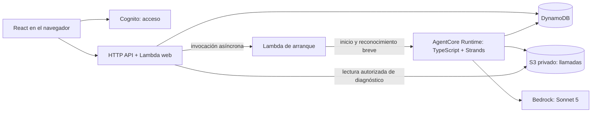

# Ejecución del juego y del agente

**Decisión final: AgentCore Runtime con Strands en TypeScript y Amazon Bedrock mediante su integración nativa. Implementación pendiente.** El ejecutor reúne coordinación del intento, motor y registro. La experiencia usa Probar con bloqueo de controles y animación opcional antes del resultado. Los requisitos están en [la especificación](../../README.md#documentación-del-producto); almacenamiento, cuota, un ambiente y acceso con Cognito están aprobados. Cognito usa su correo predeterminado inicialmente y SES se incorpora después; el frontend se publicará en S3 privado mediante CloudFront con Origin Access Control, según [acceso y entrega](acceso-y-entrega.md).

## Componentes y responsabilidades

La aplicación React sirve el editor y reproduce registros cerrados. Lambda autentica solicitudes, controla pertenencia y cuota, guarda configuraciones y expone consultas. AgentCore Runtime ejecuta el motor determinista, construye observaciones, llama a Bedrock y guarda el resultado. DynamoDB es la autoridad del estado del intento; el navegador nunca decide movimientos, consumo ni puntos. Los cuerpos de inferencia se conservan en S3 privado según [datos](datos.md).

El [registro de ejecución](registro-de-ejecucion.md) define estados y resoluciones para reproducir sin importar el motor en el navegador. La [animación](animacion.md) compone sprites y reacciones con un reloj de presentación independiente de la inferencia, a velocidad fija, hacia adelante y sin controles del usuario. El contrato lógico y el renderer React/SVG están aprobados; su implementación sigue pendiente.

Esas responsabilidades son módulos TypeScript del mismo repositorio, no servicios por habilidad. El motor es una función determinista sin acceso a red. El catálogo tiene identidades internas, etiquetas humanas y herramientas opacas separadas. El adaptador de inferencia tiene una implementación Bedrock y un sustituto explícito para pruebas; no necesita una plataforma de proveedores intercambiables.

## Alojamiento, loop y framework

Runtime aloja un proceso TypeScript con el ejecutor del intento. Strands aporta el SDK de modelos, herramientas, eventos y hooks. La tarea de background permite seguir calculando sin navegador ni una Lambda esperando durante toda la partida. El motor, las transacciones y la cancelación conservan una única coordinación operativa.

Cada decisión usa una instancia de agente sin historial, solo las herramientas del juego y la observación actual. La respuesta completa se valida y registra antes de ejecutar un efecto. El loop se detiene tras una acción; la siguiente llamada corresponde a una observación nueva, nunca al resultado conversacional anterior. Los hooks y la instrumentación del proveedor deben verificar ese límite y conservar el uso original.

Se mantienen dos fundamentos de la selección: Harness con una invocación por decisión es viable y permite desactivar memoria, pero necesita otro ejecutor que coordine el juego y resuelva las funciones inline; el SDK directo evita el framework, pero exige mantener la integración que Strands permite reutilizar. Runtime con Strands reúne la coordinación y las funciones locales, con una dependencia mantenida para el agente. No se afirma un ahorro de inferencia medido ni incapacidad de las alternativas. Las capacidades están documentadas en [AgentCore y Strands](../reference/agentcore.md).

CodeZip Node.js y el SDK de Runtime alojan el ejecutor y su tarea de background. Strands es una librería dentro de ese proceso; no requiere desplegar otro servicio. La Lambda web conserva sus responsabilidades de API, identidad y cuota.

Para iniciar, una **Lambda breve invocada asíncronamente** llama a Runtime y espera solamente su reconocimiento. Se usa la cola administrada de esa modalidad de Lambda. La alternativa directa —Lambda web llama a Runtime— elimina una función, pero expone la petición web al arranque frío de Runtime y al límite de integración HTTP de 30 segundos. Con diez concurrencias Lambda observadas, retener peticiones mientras arranca el agente tampoco es una base demostrada para el pico esperado. La función de arranque desacopla esos tiempos sin incorporar SQS, Step Functions ni un sistema general de trabajos.

## Recorrido completo

1. El usuario recupera su borrador del servidor, edita habilidades e instrucciones, selecciona el nivel y ajusta «Animación». El guardado del borrador informa su estado y controla versiones entre pestañas.
2. «Probar» toma exactamente el borrador visible, guarda su versión inmutable y fija el valor de Animación para el intento. No existe un paso separado de Aplicar cambios. Desde el clic quedan bloqueados editor, selector de nivel, toggle, nuevos intentos y navegación del historial. La API valida pertenencia, tamaño, catálogo y al menos una herramienta antes de admitir. Un rechazo previo conserva el borrador, muestra la causa y desbloquea sin cuota ni inferencia.
3. Una transacción DynamoDB crea el intento pendiente, fija referencias a nivel, configuración, reglas, protocolo, modelo y puntuación, e incrementa su cuota diaria conforme a la política de [datos](datos.md). Conserva el estado inicial y la opción de presentación; Animación no se envía al modelo ni modifica el cálculo.
4. La API despacha el mismo identificador a la Lambda de arranque y devuelve ese identificador. Runtime reclama condicionalmente el intento pendiente con un identificador de ejecutor, registra su tarea de background y reconoce el inicio. Solo el ejecutor que obtuvo el claim puede inferir y publicar acciones.
5. Por decisión, guarda la solicitud efectiva, invoca Bedrock, guarda la respuesta y el uso, valida la elección y aplica la función de motor. Una transacción publica el evento y el estado posterior. Solo entonces continúa.
6. El cierre conserva resultado, causa, estado final y métricas. Solo una victoria con uso completo obtiene puntaje clasificable; la clasificación propia agrupa nivel y parámetros compatibles. Se conserva toda derrota, límite, cancelación y error para diagnóstico.
7. React consulta el estado mientras la página está activa. Al cerrarse el registro, si Animación estaba encendida reproduce automáticamente los eventos y solo después muestra resultado, métricas y puntaje; si estaba apagada muestra directamente el resultado. El editor continúa bloqueado durante la animación. Sin eventos reproducibles se muestra el resultado operativo directamente. Ambas rutas conservan el mismo registro completo.
8. Al mostrar el resultado se habilitan edición, toggle, nivel, historial y Probar. Se puede reproducir manualmente un intento guardado, incluso si se ejecutó con Animación apagada, sin inferencia ni consumo nuevos. Recargar durante un cálculo recupera el intento y su opción fijada; la UI respeta el mismo orden de presentación al terminar.

El estado del servidor y el de la pantalla son distintos: un intento cerrado puede estar siendo animado en el navegador. Durante el cálculo solo queda disponible Cancelar como control operativo; durante la animación no hay controles operativos y la edición sigue bloqueada hasta su fin automático. La definición completa de bloqueo y transiciones está en [experiencia](../intent/experiencia.md) e [intentos](../intent/intentos.md).

La misma pantalla sirve para el booth y el uso individual. El segundo nivel reutiliza las habilidades e instrucciones con otro mapa fijo. La frase de preferir la derecha permanece visible y editable antes de Probar; no se agrega una estrategia oculta.

## Inferencia

Se usa **Claude Sonnet 5 mediante el proveedor nativo `BedrockModel` de Strands**, desde `us-east-1`, con credenciales temporales del rol y el perfil `global.anthropic.claude-sonnet-5`. La inferencia usa Amazon Bedrock Runtime con Converse sin streaming. El perfil global está permitido por la política regional y tiene menor tarifa publicada que la modalidad geo/regional de ese modelo. No se usa Mantle ni un proveedor propio para conectarlo. Véanse [Bedrock](../reference/bedrock.md) y [Strands](../reference/agentcore.md#strands-dentro-de-runtime).

El proveedor nativo permite Converse sin streaming (`stream: false`), apropiado para una elección breve y para conservar la respuesta completa antes de actuar. Cada decisión usa protocolo mínimo, instrucciones literales, todas las herramientas habilitadas y observación local. Se solicita selección de herramienta; **`any` no se trata como garantía de exactamente una**. La aplicación valida la cantidad y el schema antes de ejecutar cualquier efecto. Una respuesta inválida queda registrada y termina con error; no se corrige ni se ejecuta parcialmente. No se envían resultados de herramientas ni historial en otra llamada. Una descripción vacía se omite sin completarla.

Defaults técnicos propuestos: thinking desactivado, sin caché explícita inicial, salida acotada por `maxTokens`, y parámetros efectivos conservados en el snapshot. El valor de salida se ajusta a la elección breve de herramienta al integrar el modelo; una respuesta truncada es un error de contrato. No se asume que tokens equivalgan a bytes. Las estimaciones de contexto de Strands no sustituyen los tokens reales del proveedor para consumo o puntaje.

El request y response efectivos se conservan antes de cualquier reducción a eventos o métricas normalizadas de Strands. Los hooks del agente por sí solos no se consideran prueba de captura íntegra del body del proveedor; la instrumentación del cliente de inferencia debe comprobar ese contrato. Las opciones documentadas permiten configurar el cliente AWS y la modalidad sin streaming, pero esa integración todavía no fue ejecutada.

El acceso y las cuotas se habilitan en la API elegida. La [observación de cuenta](../reference/cuenta-aws.md) registró `agreementAvailability=NOT_AVAILABLE` y cuotas de tokens en cero; deben comprobarse y resolverse antes de la inferencia real. Son tareas de preparación del entorno, no una razón para cambiar la arquitectura. No hay fallback automático ni cambio oculto de modelo dentro de un intento.

## Duplicados, fallos y continuidad

La clave de idempotencia se crea antes del primer envío. Repetirla con el mismo contenido recupera el mismo intento; usarla con otro contenido produce conflicto. La asociación se conserva con los datos, no depende de los diez minutos de deduplicación del token transaccional de DynamoDB. Duplicados de HTTP, Lambda o Runtime convergen en el mismo claim. No se transfiere el claim ni se reanuda automáticamente un proceso perdido.

Guardar la admisión y despachar Lambda **no es atómico**. Si se pierde un reconocimiento, la UI puede reenviar el inicio del mismo intento sin otra cuota. Hay una fecha límite de inicio documentada y configurable: al vencer, una transición condicional cierra un pendiente como error y bloquea arranques tardíos. El backend distingue un despacho no confirmado de un rechazo anterior a la admisión. No promete que toda admisión sobrevivirá cualquier caída sin intervención.

Una tarea de Runtime sigue viva tras desconectar el navegador gracias al registro de actividad del SDK. Eso no proporciona durabilidad ante una caída del proceso. Si se pierde, se conserva lo obtenido y se informa error. El cierre por abandono técnico usa una fecha conservadora basada en el máximo de vida configurado de Runtime y su margen de terminación, no una mera falta reciente de progreso. Se materializa al consultar el intento; no necesita un vigilante permanente. Una escritura tardía no puede modificar un intento cerrado.

Los límites de inicio, vida de sesión y llamada son parámetros operativos versionados, elegidos al integrar el servicio; no objetivos de velocidad de la experiencia. No se inicia otra llamada cuando no queda margen para completarla y guardar su respuesta dentro de la vida del ejecutor. Los timeouts efectivos deben permitir que el cierre distinga llamada pendiente de llamada rechazada.

Los reintentos automáticos ocultos del SDK de inferencia se desactivan. La aplicación permite como default hasta dos reintentos con backoff para rechazos inequívocos de throttling, conservando cada llamada. Una respuesta semánticamente inválida termina con error; no se corrige ni se vuelve a preguntar con contexto adicional. Un timeout o corte de transporte cuyo procesamiento sea incierto termina con uso desconocido para esa llamada, sin repetir una inferencia potencialmente cobrada. Reintentar una escritura de los mismos bytes o consultar una transacción ambigua no vuelve a llamar al modelo.

## Cancelación y concurrencia

Cancelar pendiente cierra el intento y evita su claim. Cancelar en curso registra una solicitud: impide iniciar otra llamada o publicar otra acción, pero permite guardar la respuesta y el uso de la llamada en vuelo antes del cierre. La UI indica «Cancelando» mientras corresponde. No se mata normalmente la sesión antes de recibir ese uso.

La frontera de una llamada en vuelo es su registro previo condicionado a que no haya cancelación. Una llamada autorizada antes de cancelar puede terminar y consumir tokens aunque el envío de red coincida con la cancelación; DynamoDB y Bedrock no comparten una transacción. Se informa ese consumo y no se publica su acción si la cancelación ganó la carrera.

La carrera entre cancelar y publicar una acción se resuelve con condiciones en DynamoDB: si la acción se publicó primero, cuenta; si la cancelación se aceptó primero, esa acción no se publica. Una victoria ya cerrada no cambia a cancelación. Un proceso perdido durante cancelación conserva el resultado técnico real y la solicitud, sin inventar una confirmación del ejecutor.

Cada intento tiene un único ejecutor, pero no se impone un nuevo límite de un intento activo por usuario. Dos inicios distintos consumen dos lugares de la cuota; dos envíos del mismo inicio consumen uno. Borradores usan control de versión para que una segunda pestaña no sobrescriba silenciosamente una edición más reciente.

## Costo y comprobación necesaria

El consumo por intento depende de llamadas, entrada reenviada y salida real. Se conserva uso original y componentes normalizados sin duplicar caché. La tarifa opcional de inferencia se versiona; no se promete gasto mensual ni costo cero de infraestructura. Los límites de turnos y salida, la cuota y la ausencia de llamadas durante replay acotan trabajo concreto sin agregar un corte global de gasto no solicitado.

La verificación debe cubrir el circuito real y las reglas ya definidas en [juego](../intent/juego.md), [agente](../intent/agente.md) e [intentos](../intent/intentos.md): payload sin memoria ni filtrado de tools, acciones y fases deterministas, estados terminales, duplicados y cancelación, continuidad al cerrar el navegador y replay sin proveedor. Un ensayo de carga debe comprobar el comportamiento hasta cien usuarios con un patrón documentado y complementar las lecturas de cuotas; no se infiere capacidad a partir de una tabla AWS ni se inventa una latencia objetivo.
