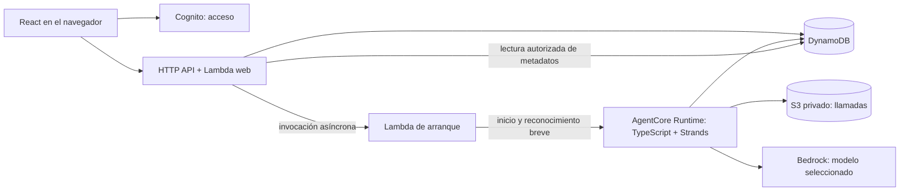

# Ejecución del juego y del agente

**Ejecución estática con Sonnet 4.6.** AgentCore Runtime con Strands en TypeScript y Amazon Bedrock mediante su integración nativa reúne la coordinación del intento, el motor estático y el registro. El nivel `principal-estatico-v1` conserva el resultado y permite consultar intentos propios. La fase 4 agrega preferencia persistida de Animación, reproducción desde el registro cerrado y cierre explícito de la presentación. Sonnet 4.6 es el único modelo disponible para intentos nuevos; los perfiles históricos conservan su identidad y parámetros. Los requisitos están en [la especificación](../../README.md#documentación-del-producto); Cognito usa su correo predeterminado inicialmente y SES se incorpora después; el frontend se publica en S3 privado mediante CloudFront con Origin Access Control, según [acceso y entrega](acceso-y-entrega.md).

## Componentes y responsabilidades

React sirve el editor, el estado del intento, su resultado, el historial y la reproducción con SVG. Lambda autentica solicitudes, controla pertenencia y cuota, guarda configuraciones y expone las consultas del intento y su proyección pública para replay. AgentCore Runtime ejecuta el motor determinista, construye observaciones, llama a Bedrock y guarda el resultado. DynamoDB es la autoridad del estado del intento; el navegador nunca decide movimientos, consumo ni puntos. Los cuerpos de inferencia se conservan en S3 privado según [datos](datos.md). La API no expone un endpoint de bodies o diagnóstico detallado. Para recuperar el uso, su rol puede leer objetos y comprobar su existencia únicamente en el bucket privado de inferencias. Una consulta no intenta recuperar la respuesta de una llamada aún activa; después del cierre o del vencimiento, un objeto ausente conserva el registro incompleto y un error real de S3 se informa como fallo de dependencia.

El [registro de ejecución](registro-de-ejecucion.md) define estados y resoluciones para reproducir sin importar el motor en el navegador. La [animación](animacion.md) y el renderer React/SVG presentan las acciones cerradas sin volver a llamar al modelo.

Esas responsabilidades son módulos TypeScript del mismo repositorio, no servicios por habilidad. El motor es una función determinista sin acceso a red. El catálogo tiene identidades internas, etiquetas humanas y herramientas opacas separadas. El adaptador de inferencia tiene una implementación Bedrock y un sustituto explícito para pruebas; no necesita una plataforma de proveedores intercambiables.

## Alojamiento, loop y framework

Runtime aloja un proceso TypeScript con el ejecutor del intento. Strands aporta el SDK de modelos, herramientas, eventos y hooks. La tarea de background permite seguir calculando sin navegador ni una Lambda esperando durante toda la partida. El motor, las transacciones y la cancelación conservan una única coordinación operativa.

Cada decisión usa una instancia de agente sin historial, solo las herramientas del juego y la observación actual. La respuesta completa se valida y registra antes de ejecutar un efecto. El loop se detiene tras una acción; la siguiente llamada corresponde a una observación nueva, nunca al resultado conversacional anterior. Los hooks y la instrumentación del proveedor deben verificar ese límite y conservar el uso original.

Se mantienen dos fundamentos de la selección: Harness con una invocación por decisión es viable y permite desactivar memoria, pero necesita otro ejecutor que coordine el juego y resuelva las funciones inline; el SDK directo evita el framework, pero exige mantener la integración que Strands permite reutilizar. Runtime con Strands reúne la coordinación y las funciones locales, con una dependencia mantenida para el agente. No se afirma un ahorro de inferencia medido ni incapacidad de las alternativas. Las capacidades están documentadas en [AgentCore y Strands](../reference/agentcore.md).

CodeZip Node.js y el SDK de Runtime alojan el ejecutor y su tarea de background. Strands es una librería dentro de ese proceso; no requiere desplegar otro servicio. La Lambda web conserva sus responsabilidades de API, identidad y cuota.

### Contrato operativo vigente del nivel estático

El nivel publicado en el código es `principal-estatico-v1`, con tramos `ground`, `pit`, `ground`, `branch`, `ground`, salida en el apoyo 5 y límite de 12 acciones. No hay objetos, inventario, espera ni terreno periódico. Las cinco entradas del catálogo conservan sus IDs opacos: `tool_1` Avanzar, `tool_2` Retroceder, `tool_3` Saltar, `tool_4` Agacharse y avanzar y `tool_5` Nadar. Nadar es un no-op; la observación sólo contiene el apoyo local, el tramo inmediato a cada lado o un límite y la salida/objetos del apoyo actual.

La configuración efectiva fija `engineVersion=static-engine-v1`, `protocolVersion=tool-protocol-v1`, `inferenceVersion` del perfil seleccionado, `scoreVersion=score-v1`, presupuesto de salida por modelo y los parámetros de puntaje base 1000, peso de turno 10, peso de tokens 1, unidad 1000, dos decimales y negativos permitidos. Los plazos operativos guardados son: inicio pendiente 5 minutos, evento de starter 5 minutos, vida de Runtime 30 minutos, llamada 60 segundos, reserva de guardado 30 segundos y margen de terminación 2 minutos. No son objetivos de latencia.

El Runtime registra una tarea asíncrona y el coordinador conserva snapshots de estado, llamadas y acciones en DynamoDB; los bodies completos de inferencia van a S3 privado. La continuidad al cerrar el navegador depende del proceso y de los registros persistidos. Una caída del proceso conserva lo ya escrito y cierra el intento como error; no hay reanudación automática del juego.

Para iniciar, una **Lambda breve invocada asíncronamente** llama a Runtime y espera solamente su reconocimiento. Se usa la cola administrada de esa modalidad de Lambda. La alternativa directa —Lambda web llama a Runtime— elimina una función, pero expone la petición web al arranque frío de Runtime y al límite de integración HTTP de 30 segundos. Con diez concurrencias Lambda observadas, retener peticiones mientras arranca el agente tampoco es una base demostrada para el pico esperado. La función de arranque desacopla esos tiempos sin incorporar SQS, Step Functions ni un sistema general de trabajos.

## Recorrido completo

El circuito actualmente implementado es:

1. El usuario recupera su borrador, elige modelo, edita habilidades e instrucciones, ajusta la preferencia de Animación y pulsa «Probar». No hay selector de nivel; se usa el nivel estático publicado. La admisión fija el valor vigente de `animationEnabled` para ese intento.
2. La interfaz captura el borrador visible y la versión confirmada. La API valida identidad, versión, catálogo, tamaño y al menos una habilidad habilitada. Un rechazo previo conserva el borrador y no consume cuota.
3. Una transacción de DynamoDB crea el intento pendiente, guarda el snapshot inicial, la configuración completa del nivel/modelo/puntaje y el contador diario. La admisión y el despacho del starter no son una transacción atómica.
4. La API invoca asíncronamente la Lambda de starter. El starter valida el intento pendiente, invoca el Runtime y devuelve sólo el reconocimiento del despacho. Runtime reclama el intento con un ejecutor y crea su tarea asíncrona.
5. Cada decisión construye una observación local nueva, persiste el request antes del envío, ejecuta una llamada Bedrock, persiste el response completo y su uso, valida una única herramienta y aplica el motor estático. La acción y el snapshot posterior se publican con condiciones de ejecutor y secuencia.
6. El cierre conserva resultado, causa, último snapshot, llamadas y métricas. La puntuación sólo se calcula para una victoria con `gameTokens` conocido; los demás estados conservan avance y métricas sin puntaje.
7. React consulta el resumen del intento y permite cancelar mientras calcula. Cuando cierra, muestra el resultado directamente si Animación estaba desactivada o si no hubo acciones; en caso contrario reproduce el registro con un único reloj y después marca la presentación terminada. El resultado y el historial ofrecen replay manual de intentos con acciones. Al cerrar o recargar, el navegador vuelve a consultar el mismo intento; el replay no crea una inferencia nueva.

La aprobación de una cancelación o el cierre por error impide nuevas acciones. Una llamada ya autorizada puede terminar y conservar su uso antes del cierre; DynamoDB, S3 y Bedrock no comparten una transacción. Una escritura tardía no reabre un intento cerrado. La definición de autorización, pertenencia y transiciones está en [experiencia](../intent/experiencia.md) e [intentos](../intent/intentos.md).

### Diseño aprobado para fases posteriores

Fase 5 agregará terrenos periódicos y Esperar; fase 6 objetos y recompensas; fase 7 llaves y salidas bloqueadas; fase 8 diagnóstico de prompts/responses; fases 9 y 10 comparación y segundo recorrido. Esas capacidades siguen siendo compromisos del diseño general y no forman parte del nivel estático actual.

## Inferencia

La integración usa **`BedrockModel` de Strands 1.18.0 y Converse sin streaming** para el catálogo finito de OpenAI y Claude, desde `us-east-1` y con credenciales IAM. `shared/models.ts` es la autoridad de claves, etiquetas, perfiles y disponibilidad para nuevas admisiones; la UI sólo elige una clave. Sonnet 4.6 es el único perfil disponible. La tabla conserva además los perfiles conocidos para leer y recuperar datos históricos; no declara operativos los modelos diferidos. No hay APIs directas de fabricantes, Mantle, claves API nuevas ni descubrimiento de modelos durante cada intento. El cliente AWS fija `maxAttempts=1`.

| Modelo | Perfil global | Salida máxima | Razonamiento y herramientas |
|---|---|---:|---|
| GPT-5.6 (Sol) | `global.openai.gpt-5.6-sol` | 4096 | Sin override de reasoning; `auto`. |
| Claude Sonnet 4.6 | `global.anthropic.claude-sonnet-4-6` | 512 | Thinking omitido, desactivado por el contrato del modelo; `any`. |
| Claude Sonnet 5 | `global.anthropic.claude-sonnet-5` | 512 | Thinking explícitamente desactivado; `any`. |
| Claude Opus 5 | `global.anthropic.claude-opus-5` | 512 | Thinking explícitamente desactivado; `any`. |
| Claude Opus 5.5 | `global.anthropic.claude-opus-5-5` | 4096 | Adaptive thinking, esfuerzo `low`; `auto`. |

Sonnet 4.6 es el default de borradores e intentos nuevos. GPT-5.6 Sol, Sonnet 5 y Opus 5/5.5 no se admiten en intentos nuevos hasta completar su habilitación y verificación. Los borradores previos conservan su elección y requieren cambiarla explícitamente a Sonnet 4.6; los registros v1 siguen significando Sonnet 5. La recuperación por clave de intentos ya admitidos precede a este control de disponibilidad. Los límites son parámetros técnicos guardados por intento. No se envían temperature ni controles de caché por analogía entre proveedores. Omitir un override se registra como omisión, sin inventar el valor efectivo del servicio. GPT-6 Luna y Sol quedan fuera del selector hasta que exista disponibilidad Bedrock confirmada; no se sustituyen por otros modelos.

Cada intento guarda el perfil completo y versionado; el ejecutor usa ese snapshot aunque cambien los defaults. La identidad efectiva también queda en cada llamada, porque Converse incluye el modelo en la ruta HTTP y no en el body. La disponibilidad documental no acredita permisos, cuota o inferencia exitosa en la cuenta. Véanse [Bedrock](../reference/bedrock.md) y [Strands](../reference/agentcore.md#strands-dentro-de-runtime).

Cada decisión usa protocolo mínimo, instrucciones literales, todas las herramientas capturadas y observación local. Se solicita `toolChoice` según el perfil; **ni `any` ni `auto` sustituyen la validación de exactamente una acción**. Opus 5.5 exige razonamiento y no admite tools forzadas. Los bloques nativos de razonamiento de un perfil que los admite se conservan como contenido no accionable; texto como respuesta o plan, bloques desconocidos, cero/múltiples tools y truncamiento son errores. La respuesta se valida para exigir una única llamada habilitada y argumentos del schema antes de ejecutar cualquier efecto. Una respuesta inválida queda registrada y termina con error; no se corrige ni se ejecuta parcialmente. No se envían resultados de herramientas ni historial en otra llamada. Una descripción vacía se omite sin completarla.

La captura de request/response usa un `requestHandler` auditado: guarda el body efectivo antes del envío y el body completo antes de reducirlo a uso/acción. Una respuesta truncada, incompleta o semánticamente inválida no ejecuta una acción. Los tokens normalizados conservan entrada, salida, caché, `reasoningTokens` y `gameTokens` sin sumar dos veces categorías. Reasoning es un detalle incluido en salida; su ausencia queda desconocida y no invalida un total de entrada/salida inequívoco. No se asume que tokens equivalgan a bytes. La implementación actual no agrega una continuación conversacional ni un reintento oculto del SDK; se permiten como máximo dos reintentos adicionales ante throttling inequívoco, con un registro por envío. No se reintentan cortes ambiguos, timeout ni respuestas semánticamente inválidas.

El request y response efectivos se conservan antes de cualquier reducción a eventos o métricas normalizadas de Strands. Los hooks del agente por sí solos no se consideran prueba de captura íntegra del body del proveedor; la instrumentación del cliente de inferencia es la autoridad del registro local.

El acceso, la cuota y el acuerdo del modelo siguen requiriendo comprobación del ambiente antes de afirmar una ejecución real. La [observación de cuenta](../reference/cuenta-aws.md) conserva lecturas previas y no sustituye esa comprobación. No hay fallback automático ni cambio oculto de modelo dentro de un intento.

## Duplicados, fallos y continuidad

La clave de idempotencia se crea antes del primer envío. Repetirla con el mismo contenido recupera el mismo intento; usarla con otro contenido, incluido sólo un cambio de modelo o de Animación, produce conflicto. La recuperación de una clave existente precede a nueva cuota o disponibilidad del catálogo; no vuelve a resolver el perfil contra defaults actuales. La asociación se conserva con los datos, no depende de los diez minutos de deduplicación del token transaccional de DynamoDB. Duplicados de HTTP, Lambda o Runtime convergen en el mismo claim. No se transfiere el claim ni se reanuda automáticamente un proceso perdido.

Guardar la admisión y despachar Lambda **no es atómico**. Si se pierde un reconocimiento, la UI puede reenviar el inicio del mismo intento sin otra cuota. Hay una fecha límite de inicio documentada y configurable: al vencer, una transición condicional cierra un pendiente como error y bloquea arranques tardíos. El backend distingue un despacho no confirmado de un rechazo anterior a la admisión. No promete que toda admisión sobrevivirá cualquier caída sin intervención.

Una tarea de Runtime sigue viva tras desconectar el navegador gracias al registro de actividad del SDK. Eso no proporciona durabilidad ante una caída del proceso. Si se pierde, se conserva lo obtenido y se informa error. El cierre por abandono técnico usa una fecha conservadora basada en el máximo de vida configurado de Runtime y su margen de terminación, no una mera falta reciente de progreso. Se materializa al consultar el intento; no necesita un vigilante permanente. Una escritura tardía no puede modificar un intento cerrado.

Los límites de inicio, vida de sesión y llamada son parámetros operativos versionados, elegidos al integrar el servicio; no objetivos de velocidad de la experiencia. No se inicia otra llamada cuando no queda margen para completarla y guardar su respuesta dentro de la vida del ejecutor. Los timeouts efectivos deben permitir que el cierre distinga llamada pendiente de llamada rechazada.

Los reintentos automáticos ocultos del SDK de inferencia se desactivan y el cliente fija un solo intento de transporte. El diseño aprobado permite hasta dos reintentos adicionales sólo por throttling inequívoco, con ordinal y uso propios; esa política sigue separada de cualquier retry de escritura y debe quedar explícita en el coordinador antes de presentarse como comportamiento verificado. Una respuesta semánticamente inválida termina con error; no se corrige ni se vuelve a preguntar con contexto adicional. Un timeout o corte de transporte cuyo procesamiento sea incierto termina con uso desconocido para esa llamada. Reintentar una escritura de los mismos bytes o consultar una transacción ambigua no vuelve a llamar al modelo.

## Cancelación y concurrencia

Cancelar pendiente cierra el intento y evita su claim. Cancelar en curso registra una solicitud: impide iniciar otra llamada o publicar otra acción, pero permite guardar la respuesta y el uso de la llamada en vuelo antes del cierre. La UI indica «Cancelando» mientras corresponde. No se mata normalmente la sesión antes de recibir ese uso.

La frontera de una llamada en vuelo es su registro previo condicionado a que no haya cancelación. Una llamada autorizada antes de cancelar puede terminar y consumir tokens aunque el envío de red coincida con la cancelación; DynamoDB y Bedrock no comparten una transacción. Se informa ese consumo y no se publica su acción si la cancelación ganó la carrera.

La carrera entre cancelar y publicar una acción se resuelve con condiciones en DynamoDB: si la acción se publicó primero, cuenta; si la cancelación se aceptó primero, esa acción no se publica. Una victoria ya cerrada no cambia a cancelación. Un proceso perdido durante cancelación conserva el resultado técnico real y la solicitud, sin inventar una confirmación del ejecutor.

Cada intento tiene un único ejecutor, pero no se impone un nuevo límite de un intento activo por usuario. Dos inicios distintos consumen dos lugares de la cuota; dos envíos del mismo inicio consumen uno. Borradores usan control de versión para que una segunda pestaña no sobrescriba silenciosamente una edición más reciente.

## Costo y comprobación necesaria

El consumo por intento depende de llamadas, entrada reenviada y salida real. Se conserva uso original y componentes normalizados sin duplicar caché. La tarifa opcional de inferencia se versiona; no se promete gasto mensual ni costo cero de infraestructura. Los límites de turnos y salida, la cuota y la ausencia de llamadas durante replay acotan trabajo concreto sin agregar un corte global de gasto no solicitado.

La verificación de fase 4 cubre además la preferencia entre sesiones, la presentación opcional, la reproducción de registros anteriores, el cierre sin acciones y la ausencia de llamadas al modelo durante replay. La carga de cien usuarios pertenece a una fase posterior. La comprobación desplegada debe vincular versión, ambiente, intentos y cuota; no se infiere capacidad a partir de una tabla AWS ni se inventa una latencia objetivo.
